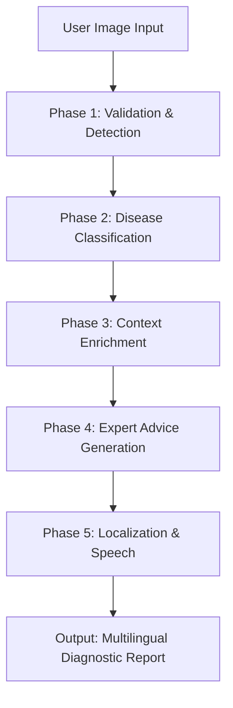

# Project Methodology: AI Crop Doctor Agent

This document provides a comprehensive, step-by-step breakdown of the technical methodology, models, and logic used in the **AI Crop Doctor** project. This is designed for academic and technical reviewers to understand the "how" and "why" of every component.

---

## 1. High-Level Architecture
The project is built as a **Multi-Agent AI System** using a tiered "Reliability First" architecture. It ensures that even if one model or API fails, the system transitions gracefully to a fallback to provide the farmer with a result.

---

## 2. Phase 1: Image Validation & Plant Detection
**Purpose:** To prevent "Garbage In, Garbage Out" by ensuring the input is actually a plant.

### Model 1: YOLOv8 - The Plant Gatekeeper (The Story of Localization)
**Model:** YOLOv8 (You Only Look Once) - `foduucom/plant-leaf-detection-and-classification`
**The Internal Journey:**
1.  **Input (640x640 Grid):** The image is first divided into a grid. Unlike traditional models that look at the image many times, YOLOv8 looks once to save time.
2.  **Backbone (CSPNet - The Feature Scavenger):** The image enters the **CSPDarknet53** backbone. Think of this as a scavenger hunt where different layers extract "low-level" features (edges of the leaf) and "high-level" features (the complex shape of the plant).
3.  **Neck (PANet - The Multi-Scale Interpreter):** Features from the backbone are passed to the **Path Aggregation Network (PANet)**. This is crucial because leaves can be tiny (a sprout) or huge (a broad leaf). PANet fuses these different scales together so the model doesn't "lose" small plants.
4.  **Decoupled Head (The Decision Maker):** Finally, the data hits a dual-branch head. 
    -   **Branch A (Regression):** Predicts the exact boundaries [x, y, w, h] of the leaf.
    -   **Branch B (Objectness):** Calculates the probability score. 
    -   **Rejection Criteria:** Any detection with a confidence score below **0.5 (50%)** is automatically discarded. If no box exceeds this threshold, the image is rejected as "Not a Plant".

#### Mathematical Example of the Probability Gate:
To understand how the "Objectness" score is actually calculated, consider this real-world scenario during an image scan:
1.  **Step 1 (Raw Logit):** As the pixels of a leaf pass through the Decoupled Head, Branch B outputs a raw numerical value (Logit) of **1.38**.
2.  **Step 2 (Sigmoid Activation):** The system passes this through the Sigmoid function: $\sigma(x) = \frac{1}{1 + e^{-x}}$.
    -   Calculation: $\frac{1}{1 + e^{-1.38}} \approx \mathbf{0.80}$ (or **80% confidence**).
3.  **Step 3 (The Decision):** Because $0.80 \geq 0.5$, the system **Accepts** this box as a valid plant and passes it to the next phase.

4.  **Counter-Example (Noisy Background):** If the model looks at a blurry background object, the logit might be **-0.85**. 
    -   Calculation: $\sigma(-0.85) = \frac{1}{1 + e^{0.85}} \approx \mathbf{0.30}$ (or **30% confidence**).
    
    -   Decision: Because $0.30 < 0.5$, the system **Rejects** the image immediately as a "Non-Plant".

5.  **Function:** `detect_plant_detailed()` in `plant_detector.py`.

### Model 2: HSV Color Heuristic - The Rapid Pre-Filter (The Story of Color Purity)
**Method:** HSV (Hue, Saturation, Value) Color Space Analysis
**The Internal Journey:**
1.  **Step 1 (Color Space Shift):** Standard images are in RGB. However, shadows and sunlight can mess up RGB values. The system converts the image to **HSV**, which separates the "Hue" (the actual color) from the brightness.
2.  **Step 2 (The Green-Band Filter):** The system scans every pixel to see if its Hue falls between **25 and 100 degrees**. This is the scientifically accepted "Green Band" for healthy and slightly yellowing vegetation.
3.  **Step 3 (Density Check):** It filters further by ensuring the color isn't too washed out (Saturation > 60) or too dark (Value > 40).
4.  **Step 4 (The Ratio Gate):** It counts every "Green" pixel and divides it by the total number of pixels in the image.

#### Mathematical Example of the Green Ratio:
Imagine a farmer uploads a photo where 1/4th of the frame is a leaf and the rest is a brown wooden table.
1.  **Total Pixels:** 10,000 (thumbnail processing size).
2.  **Green Pixels Counted:** 2,500 (pixels matching the 25-100 Hue range).
3.  **Density Calculation:** $\frac{2,500}{10,000} = \mathbf{0.25}$ (or **25%**).
4.  **Decision:** Because $0.25 > 0.10$ - **Why?** Acting as a lightweight "Gatekeeper", it rejects images with <10% green content as non-plants before expensive AI processing begins.

### Phase 1.5: The ROI Zoom (The Story of Maximum Signal)
**Purpose:** To isolate the plant from background noise to maximize classification accuracy.
1.  **The Precision Narrowing:** Once YOLO identifies the plant's bounding box, the system doesn't just pass the whole image forward. Instead, it performs an **Adaptive Crop**.
2.  **The 5% Safety Buffer:** The system adds a small padding around the box to ensure that if a disease is eating the very edge of the leaf, those symptoms are not cut out.
3.  **The Final Extraction:** This high-density "Zoom-in" image is then fed to the MobileNetV2 pathologist. By removing the background (soil, hands, sky), we ensure the AI focuses 100% of its attention on the leaf texture, significantly reducing false diagnoses.

---

5.  **Rejection Case:** If a farmer accidentally uploads a photo of a blue tractor, the green count might be 50. $\frac{50}{10,000} = 0.005$ (0.5%). This is **Rejected** instantly, preventing a "hallucinated" disease diagnosis.

---

## 3. Phase 2: Multi-Tiered Disease Classification
This is the "Brain" of the vision system, using four layers of redundancy.

### Tier 1: Local MobileNetV2 - The Pathologist (The Story of Disease Detection)
**Architecture:** **MobileNetV2** (The "Digital Laboratory" for Plant Tissue)
**The Internal Journey:**
1.  **The Arrival (Entry):** Once an image is confirmed to be a plant, it enters the "Digital Laboratory" of MobileNetV2. The image is a 224x224 grid, which is then passed through 17 **Inverted Residual Blocks**.
2.  **The Microscopic Expansion (1x1 Conv):** To detect even the tiniest fungal spores, the model first "blows up" the data. It expands the 32 input channels into a wide, 192-channel workspace. This is like moving from a magnifying glass to a **high-powered microscope**, allowing the AI to see intricate patterns that a normal eye would miss.
3.  **The 192 Specialists (Depthwise Convolution):** Instead of one generalist, the model calls in **192 "Individual Specialists"**. Each specialist is trained to find exactly one pattern (e.g., Specialist #42 only looks for yellow halo spots; Specialist #108 only looks for leaf-edge wilting). They scan the entire image independently, looking for their specific "target."
4.  **The Evidence Synthesis (Projection):** To prevent information overload, a **Linear Bottleneck** shrinks the 192 channels back down. It discards the background "noise" (like soil or light glares) and keeps only the "Smoking Gun" evidence of the disease.
5.  **The Final Jury (Global Average Pooling):** All the specialized findings are sent to a "Grand Jury" (GAP). Every section of the image gets to vote: "Based on what I see in my corner of the leaf, this is definitely Potato Early Blight."
6.  **The Identity Registry (Label Mapping):** After the vote is finalized, the model outputs a winner as a "Class Index" (e.g., Index #20). The system then consults its internal **Identity Registry** (a list of 38 disease names) to translate that number into a human-readable name like **"Potato Early Blight."**

#### Mathematical Example of the Final Decision (Softmax):
After the "Jury" finishes voting, the model has raw scores for different diseases. To give the farmer a percentage, it uses the **Softmax Equation**: $P_i = \frac{e^{z_i}}{\sum e^{z_j}}$.

**The Scenario:**
- **Candidate 1 (Late Blight):** Raw Score = **5.2**
- **Candidate 2 (Early Blight):** Raw Score = **2.1**
- **Candidate 3 (Healthy):** Raw Score = **0.5**

**The Calculation:**
1.  The model calculates the "exponential" of each score: $e^{5.2} \approx 181.2$, $e^{2.1} \approx 8.1$, $e^{0.5} \approx 1.6$.
2.  Total Sum = $181.2 + 8.1 + 1.6 = 190.9$.
3.  **Final Probability for Late Blight:** $181.2 / 190.9 = \mathbf{0.949}$ (or **95% Confidence**).
4.  **The Logic:** Even though "Early Blight" had a positive score, the exponential power of "Late Blight" makes it the clear winner, ensuring the farmer gets a high-confidence diagnosis.

### Tier 2: Cloud Inference Fallback
- **Model:** `microsoft/resnet-50` or `akhaliq/plant-disease-classification`.
- **API:** Hugging Face Inference API.
- **Function:** `detect_disease_hf()` (API call variant) - Triggered if local PyTorch weights are missing.

### Tier 3: Vision Language Model (VLM)
- **Model:** **Llama 3.2 90B Vision**.
- **API:** GROQ Cloud.
- **Function:** `detect_disease_with_groq_fallback()` in `autogen_agents.py`.
- **Function:** Instead of simple classification, the VLM "looks" at the image and describes the pathology in natural language.

### Tier 4: Metadata/Filename Reasoning (Last Resort)
- **Model:** Llama 3.3 70B (Text).
- **Function:** `detect_disease_filename_fallback()` in `autogen_agents.py`.
- **Logic:** Uses NLP to extract clues from the filename (e.g., `tomato_blight_v1.jpg`) to provide an educated diagnosis when all vision layers fail.

---

## 4. Phase 3: Environmental Context - The Global Scout (The Story of Contextual Enrichment)
**Purpose:** To provide accurate advice, the AI must know the "environment" where the plant lives.

### The Internal Journey:
1.  **The Satellite Handshake:** While the Vision models are busy looking *at* the plant, the **Weather Agent** reaches out to the **OpenWeatherMap** satellite grid. It proxies the farmer's GPS coordinates to pinpoint their exact field.
2.  **Gathering the Catalysts:** The Scout fetches the "Atmospheric Indicators": **Temperature** and **Relative Humidity**. 
3.  **The Fungal Alert:** In the agricultural world, weather is a "Disease Accelerator." For example, if humidity is above 75%, fungal spores can double their spread rate in hours. The Scout passes this critical "Climate Context" to the final advisor.

#### Technical Logic of the Scout:
The Scout uses a **Real-time API Proxy** to inject climate data into the reasoning loop:
-   **Condition:** Humidity > 70% + Temp 20-28°C.
-   **Logic Effect:** The "Risk Weight" for Fungal Blight is increased. The final advice will shift from "Monitoring" to "Active Treatment" because the environment is currently hostile to the plant.

---

## 5. Phase 4: The Virtual Agronomist - The Brain (The Story of Knowledge Synthesis)
**Purpose:** Fusing all evidence (Vision + Weather + Soil) into a final treatment plan.

**Model:** **Llama 3.3 70B Versatile** (Accessed via GROQ)

### The Internal Journey:
1.  **The Information Merge:** The Advisor acts as a **"Grand Information Synthesizer."** It sits at a table with the Pathologist (Vision result) and the Scout (Weather result).
2.  **Context-Aware Reasoning:** It doesn't just say "Tomato Blight." It thinks: *"This is a Tomato plant with Blight, growing in Red Soil, during a 90% humidity rainstorm in Hyderabad."*
3.  **The Prescription Design:** The 70-billion parameter neural network uses its training data (millions of pages of agricultural science) to design a 3-step combat plan. It selects specific chemicals (like Mancozeb) or organic remedies (like Neem Oil) that are most effective for that specific soil and weather.
4.  **Prediction:** Finally, it performs **"Future-Cast"** reasoning, predicting what other diseases might strike next week if the current humidity continues.

#### The "Synthesis Prompt" Logic (How the Brain thinks):
The system constructs a multi-dimensional prompt for the LLM:
> *"You are an expert agronomist. INPUT: [Disease: Early Blight] | [Humidity: 85%] | [Soil: Alluvial]. TASK: Design a treatment that won't wash away in high rain and suits the nutrient profile of Alluvial soil."*

This ensures the advice is **Context-Aware**, not just a generic textbook answer.

### Fallback: Rule-Based Expert System
- **Function:** `generate_rule_based_advice()` in `autogen_agents.py`.
- **Logic:** A hardcoded dictionary of 50+ common disease-to-treatment mappings.
- **Why?** Ensures that even if GROQ API is down, the farmer gets a verified standard treatment.

---

## 6. Phase 5: Localization & Accessibility
**Purpose:** Breaking the language and literacy barrier.

### Input Phase: Speech-to-Text
- **API:** **Web Speech API** (Browser-native).
- **Purpose:** Allows users to "speak" their location or crop details instead of typing.
- **Logic:** Implemented in `templates/index.html` using JavaScript `webkitSpeechRecognition`.

### Translation Engine
- **Function:** `translate_text()` in `autogen_agents.py`.
- **Primary:** `deep-translator` (Google Translate API).
- **Fallback:** LLM-based translation (Llama 3.3).
- **Purpose:** Supports 100+ languages (Hindi, Telugu, Marathi, etc.).

### Speech Synthesis (The Voice Agent)
- **Library:** `gTTS` (Google Text-to-Speech).
- **Function:** Wrapper around Google's TTS engine to generate MP3s.
- **Why?** Allows farmers with limited literacy to "Listen" to the advice rather than reading complex technical terms.

---

## 7. Technical Stack Summary

| Layer | Library / API | Model / Service |
| :--- | :--- | :--- |
| **Backend** | Flask | Python 3.10+ |
| **Object Detection** | Ultralytics | YOLOv8 |
| **Classification** | PyTorch / Torchvision | MobileNetV2 |
| **Generative AI** | GROQ API | Llama 3.3 70B / 3.2 Vision |
| **Cloud Vision** | Hugging Face | ResNet-50 |
| **Weather** | Requests | OpenWeatherMap |
| **Translation** | Deep-Translator | Google Translate |
| **Speech** | gTTS | Google TTS |
| **Image Handling** | Pillow / OpenCV | HSV Logic / BGR Processing |

---

## 8. Step-by-Step Flow (Input to Output)

1. **User Uploads Image:** `app.py` receives the file.
2. **Plant Detection:** YOLOv8 checks for a leaf. If not found, HSV logic checks for green content.
3. **Disease Diagnosis:** Primary (MobileNetV2) classifies the disease with a confidence score.
4. **Context Fetching:** System calls OpenWeather based on user location.
5. **Prompt Engineering:** Diagnosis + Weather + Soil are combined into a prompt for Llama 3.3.
6. **Advice Generation:** Llama 3.3 generates a formatted technical PDF-style report.
7. **Localization:** Report is translated into the user's selected language.
8. **Audio Generation:** `gTTS` creates a playable voice note.
9. **Final Delivery:** `result.html` renders all data, images, and audio.

---
*Created for Project Review Phase 3 - Prepared by AI Crop Agent System.*
